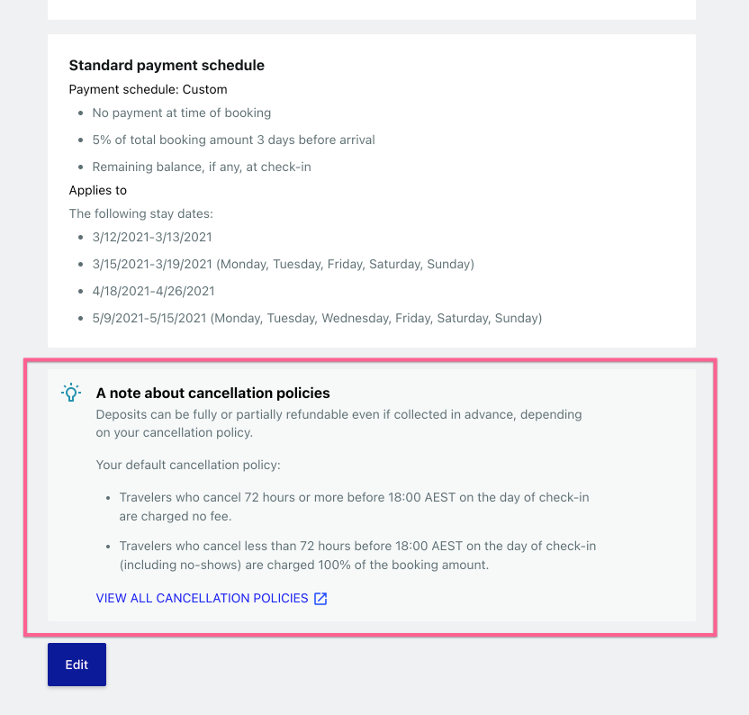
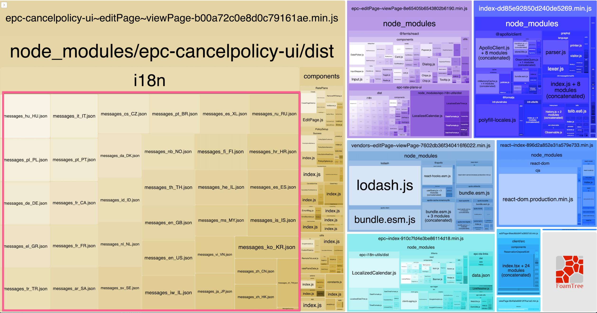
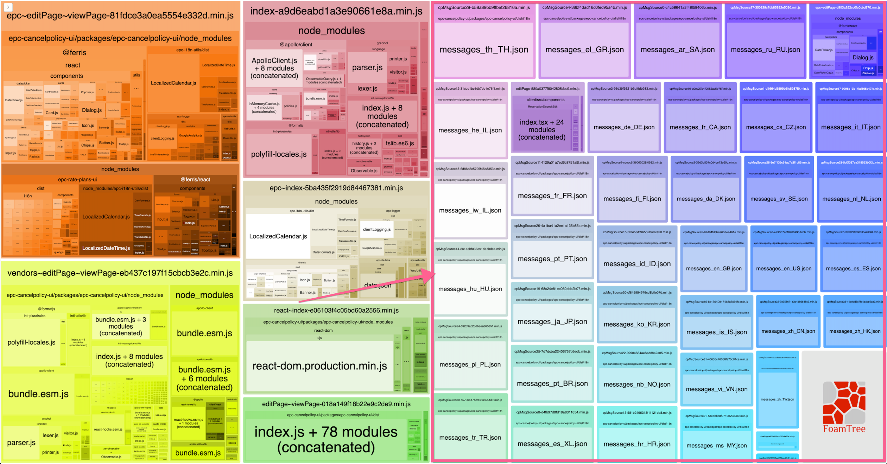

# i18n solution in shared UI component

On the partner central reservation deposits page, there is a section displaying the default cancellation policy, which is a shared UI component published on NPM. In this case, the project `epc-reservation-deposit-web` is the consumer of the shared UI component `epc-cancelpolicy-ui` . 



In `epc-reservation-deposit-web` we use the component like so,

```tsx
import { CancelPolicyNote } from 'epc-cancelpolicy-ui'

function ParentComponent() {
  return (
    <div className="default-cancel-policy">
      <CancelPolicyNote htid={propertyId} />
    </div>
  )
}
```

This is convenient but comes with a caveat. All i18n files for this piece of UI live in the component. Take a look on epc-reservation-deposit-web's bundle analysis, **All i18n files are bundled together. This means even the client only needs to display one language, it will force the user to download all 34 files:** 



In a typical server-client app, the server knows the user's locale when the request comes in and can pick the i18n file in use, generate a script to write the strings to the `Window` object,  where the client can read from.

But in terms of shared UI component, there is no way for the component to know beforehand which i18n file to use, thus all the 34 files are bundled in the component.

The consumer could have extracted all i18n files in the shared UI component, move them to the server and treat them as its own. This will solve the problem but this means the consumer need to do extra work to use this UI component instead of a simple install-and-import. 

## Dynamic import comes to resecue

Webpack supports code-splitting by dynamic import. We can configure `epc-cancelpolicy-ui`'s babel to compile all ESNext syntax except `esmodule` syntax:

```json
// .babelrc
{
  "presets": [
    [
      "@babel/preset-env",
      {
        "modules": false
      }
    ],
    ...
  ]
}
```

This way, as the author of the shared UI component, we are assuming the consumers of our component will use a bundler such as Webpack which supports `esmodule` syntax to further compile the code. 

Next, we add this function to the UI component: 

```typescript
const getMessageSource = () => {
  const locale = window?.EPC?.i18n?.locale || "en_US";
  const javaLocale = getJavaLocale(locale);

  return import(
		`../i18n/messages_${javaLocale}.json`
  )
    .then((source) => {
      const i18nCXL = {
        i18n: {
          messages: source.default
        },
      };
      window.EPC = merge(window.EPC, i18nCXL);
    })
    .catch((err) => {
  		// error handling
    });
};
```

We first get the current locale from `window`, then we dynamically import the corresponding i18n file and write to `window` object mimicking what the script generated by the server does. 

And use this function like so:

```tsx
import getMessageSource from "./getMessageSource";

interface IProps {
  htid: number;
}

const CancelPolicyNote: FC<IProps> = ({ htid }: IProps) => {
	getMessageSource()

  return (
    <ApolloProvider client={client}>
      <ContentWrap htid={htid} />
    </ApolloProvider>
  );
};
```

Look at `epc-reservation-deposit-web` 's bundle analysis again, all i18n files are in their separate chunks: 



How awesome is this! Webpack splits the i18n files into their own chunk. Now if the consumer uses our shared component, the initail bundle will not contain any i18n files. And the one i18n file that actually needed will be downloaded at run time based on the user's locale. 

## `import()`is an async function

If we load the page again, it will look like this, the i18n key for the word "Loading" is displayed instead of the actual text:

 

This is because i18n file is downloading the same time React is rendering. If the file is not downloaded before loading state is finished, even the actual content will be i18n key only.

To avoid this, we can wrap our `getMessageSource` function with a simple custom react hook:

```react
const useMessageSource = () => {
  const [isLoaded, setIsLoaded] = useState(false);

  useEffect(() => {
    getMessageSource().then(() => setIsLoaded(true));
  }, []);

  return isLoaded;
};
```

And use the hook in our component like so:

```react
const CancelPolicyNote: FC<IProps> = ({ htid }: IProps) => {
  const isMessageSourceLoaded = useMessageSource();

  if (!isMessageSourceLoaded) return null;

  return (
    <ApolloProvider client={client}>
      <ContentWrap htid={htid} />
    </ApolloProvider>
  );
};
```

Now we will ensure React won't render the actual content of the component before the i18n file is ready. 


## That is all

Lodash has a version called lodash-es, https://www.npmjs.com/package/lodash-es, the approach is the same, to leverage Webpack's code splitting for dynamic import.
